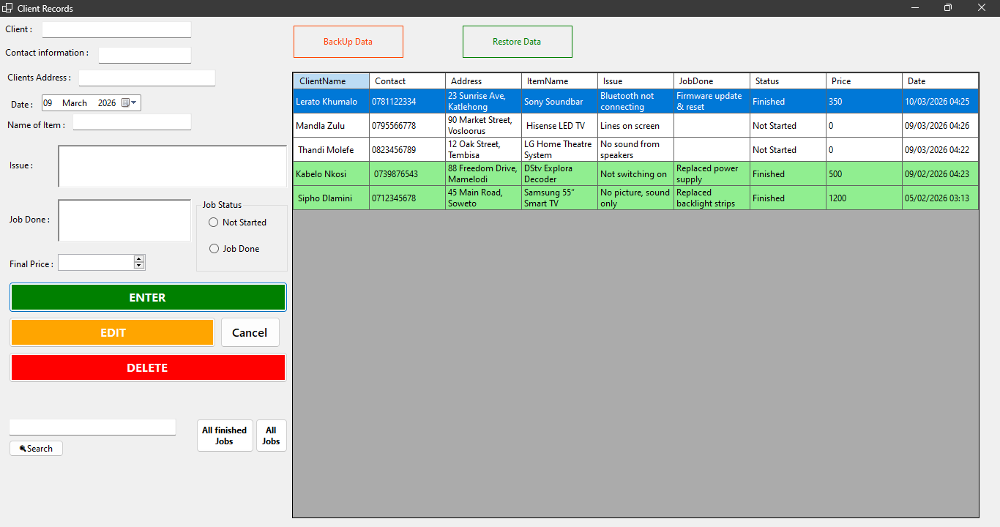
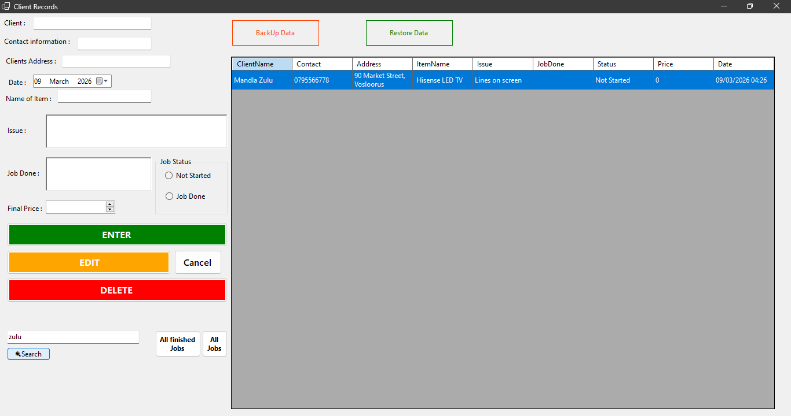
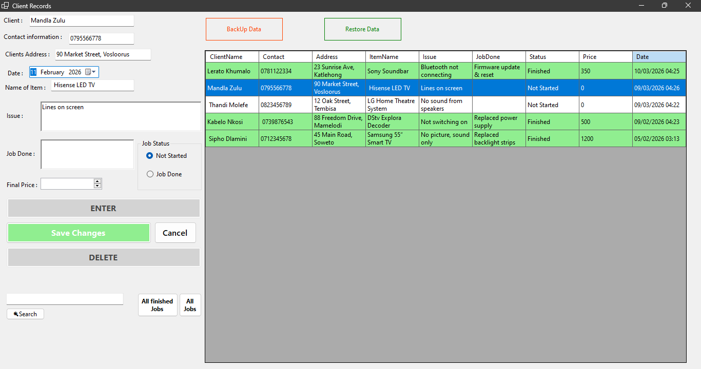
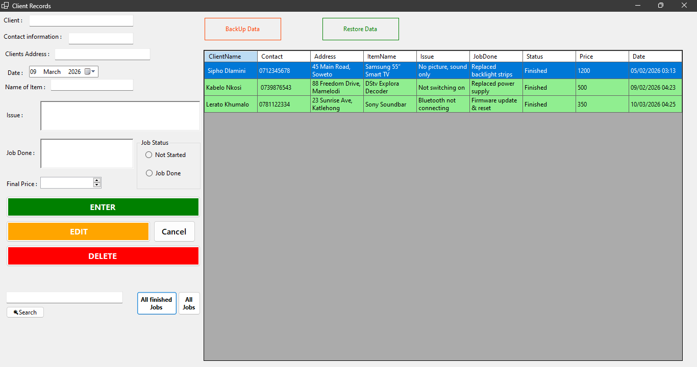

# John Audio Vision – Repair Shop Management System

A Windows Forms desktop application built to digitize my father's appliance repair business, replacing paper-based record keeping with a reliable digital system.

## 🎯 The Problem
Customer records were managed manually on paper. Finding repair history required searching through files, which was time-consuming and inefficient. There was no backup system in place.

## 💡 The Solution
A desktop application with full CRUD functionality, instant search, automatic saving, and backup/restore support.

## ✨ Features
- Full CRUD operations
- Multi-field search (name, contact, item)
- Filter by job status
- JSON data persistence
- Backup & restore functionality
- Input validation (Regex-based phone validation)
- Color-coded completed jobs
- Edit mode with state management
- Confirmation dialogs for safe deletion

## 🛠️ Tech Stack
- C#
- .NET 9 (Windows Forms)
- LINQ
- System.Text.Json
- Regex
- File I/O

## 📂 Data Storage
Data is stored locally:
Documents\JohnAudioVision\jobs.json

The application automatically:
- Creates directories if missing
- Handles errors safely with try/catch

## 🎓 Key Concepts Applied
- OOP principles
- LINQ filtering & sorting
- State management
- Defensive programming
- JSON serialization
- Event-driven programming

## 📸 Screenshots

### Main Application

### Search Function

### Edit Mode

### Completed Jobs Highlight

## How to Run

1. Clone the repository

git clone https://github.com/Thato-Root82/john-audio-vision-repair-system.git

2. Open the solution file

John Audio Vision(FromsApp).sln

3. Run the project in Visual Studio

## 👨‍💻 Author
Thato Kamohelo Mofokeng  
GitHub: github.com/Thato-Root82
