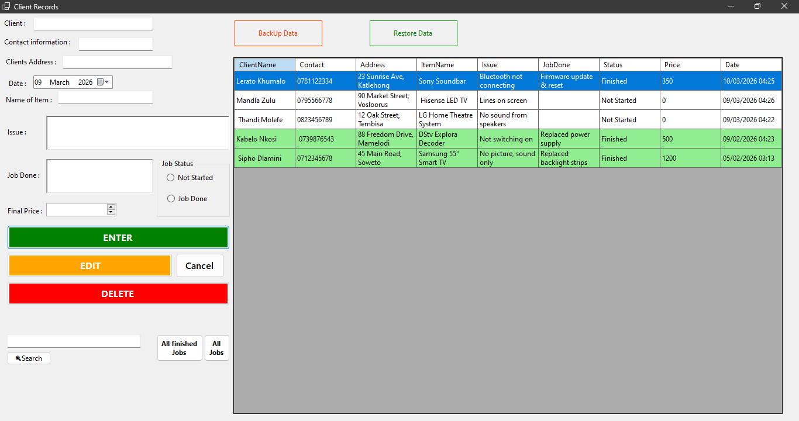
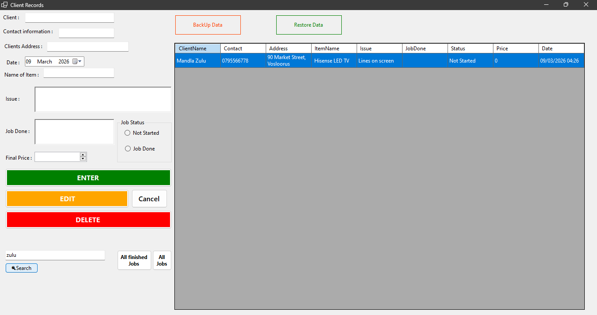
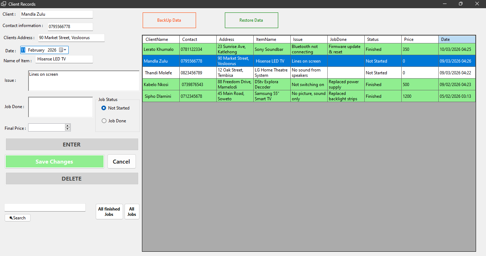
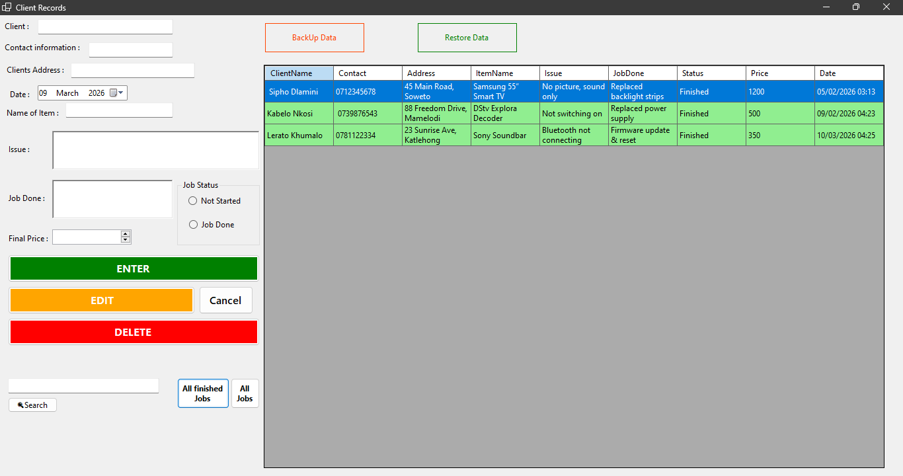

# John Audio Vision – Repair Shop Management System

A Windows Forms desktop application built to digitize my father's appliance repair business, replacing paper-based record keeping with a reliable digital system. Currently in daily production use, managing 50+ client records.

---

## The Problem

Customer records were managed manually on paper. Finding repair history required searching through physical files, which was time-consuming and inefficient. There was no backup system in place — if the paper records were lost, the business lost everything.

---

## The Solution

A desktop application with full CRUD functionality, instant search, automatic saving, and a robust backup/restore system designed to prevent data loss even if the user forgets to back up.

---

## Features

### Core Operations
- Full CRUD operations (Create, Read, Update, Delete)
- Multi-field search (client name, contact number, item name)
- Filter by job status (Finished / Not Started)
- Color-coded completed jobs (green = finished)
- Edit mode with state management
- Confirmation dialogs for safe deletion
- Regex-based phone number validation
- JSON data persistence with defensive error handling

### Backup & Recovery
- Manual backup to USB stick or SD card
- Silent auto-backup on launch if a USB drive is inserted (no interruption to workflow)
- Multiple USB drive detection with a picker dialog
- One-click Undo Restore with pre-restore snapshots
- Backup reminders — yellow banner at 5 days, red urgent banner at 8 days
- 24-hour throttled launch popup to avoid nagging
- Identical-file detection — refuses to restore a file identical to current data

---

## Tech Stack

- C#
- .NET 9 (Windows Forms)
- LINQ
- System.Text.Json
- Regex
- File I/O
- SHA256 hashing

---

## Data Storage

Data is stored locally in `Documents\JohnAudioVision\`:

- `jobs.json` — current job records
- `lastBackup.txt` — timestamp of last USB backup
- `lastPopup.txt` — timestamp of last launch popup
- `AUTOSAVES_*.json` — rolling history (last 30 kept)
- `PRERESTORE_*.json` — pre-restore snapshots for undo

The application automatically creates directories if missing and handles errors safely with try/catch.

---

## Key Concepts Applied

- Object-Oriented Programming (OOP) principles
- LINQ filtering and sorting
- State management (edit mode, undo availability)
- Defensive programming (try/catch on all file operations)
- JSON serialization and deserialization
- Event-driven programming (WinForms)
- SHA256 hashing for file comparison
- Drive detection for removable media

---

## Screenshots

### Main Application

### Search Function

### Edit Mode

### Completed Jobs Highlight

---

## How to Run

1. Clone the repository:

git clone https://github.com/Thato-Root82/john-audio-vision-repair-system.git

2. Open the solution file

John Audio Vision(FromsApp).sln

3. Run the project in Visual Studio

## 👨‍💻 Author
Thato Kamohelo Mofokeng  
GitHub: github.com/Thato-Root82
